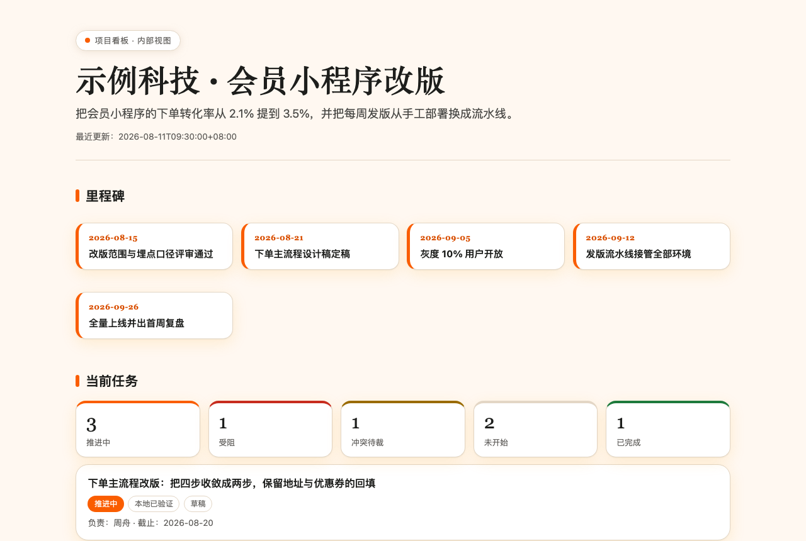
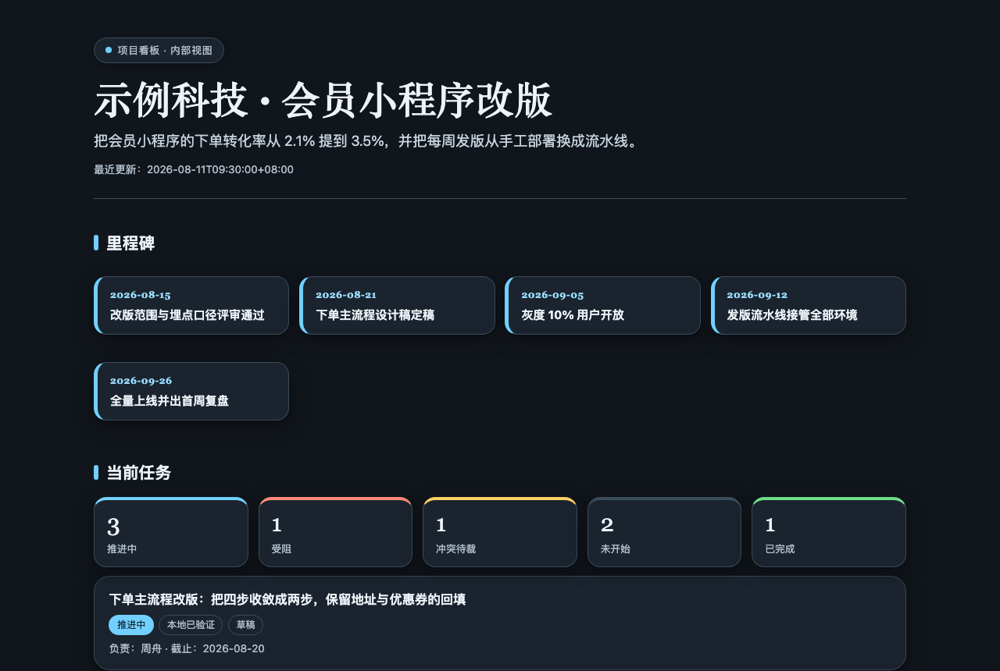
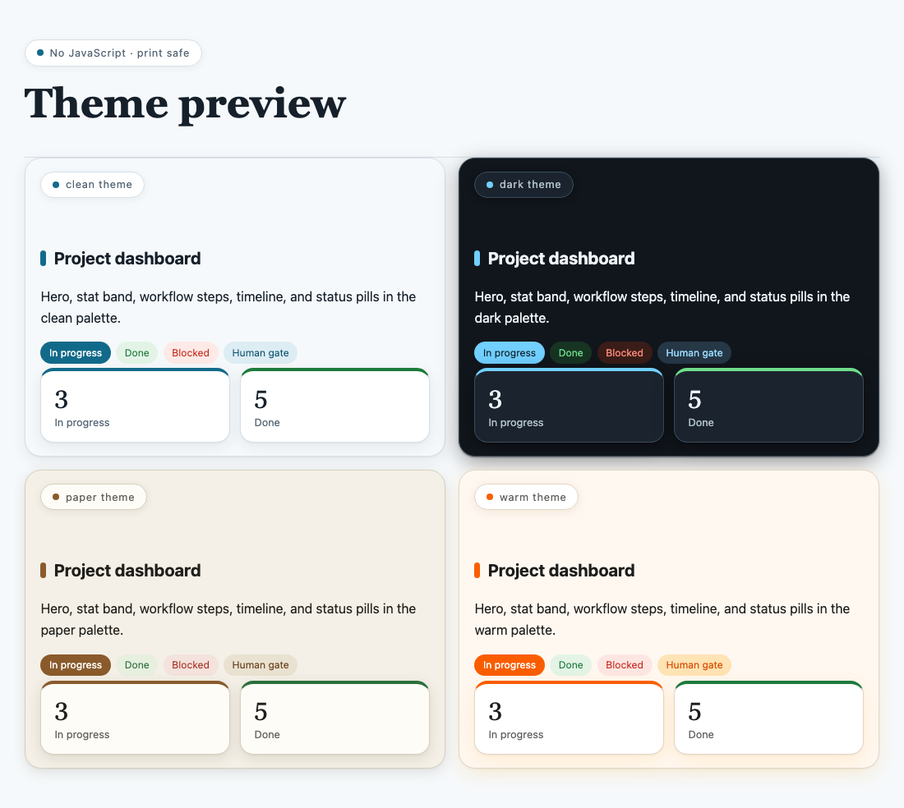
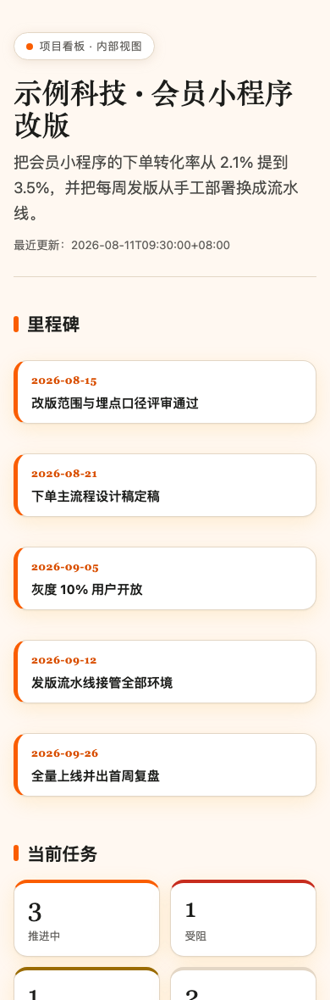

# Heige PM

<div align="center">


**项目看板锻造系统 | Traceable project dashboards from messy updates**

会议纪要进来，可溯源的项目看板出去。

[这是什么](#这是什么-what-is-this) • [为什么需要它](#为什么需要它-why-this-matters) • [看板长什么样](#看板长什么样-gallery) • [快速开始](#快速开始-quick-start) • [多端安装](#多端安装-install-anywhere)

<br>

<a href="examples/demo-board"></a>

</div>

---

## 这是什么 What is this

把会议纪要、聊天记录、飞书内容、本地文件，整理成**一页可溯源的静态项目看板**。

你肯定见过那种项目汇总：群里说做完了就写做完了，新消息一来旧结论就被盖掉，发给客户的版本忘了删内部预算。一周之后没人说得清哪句话是从哪来的。

Heige PM 把真相源钉死在一份 `project.json` 和一本来源台账上，页面只是派生视图。每条任务、每个决策都带来源引用；说了不等于验了，验了不等于验收了，字段分开记录，谁也糊弄不了谁。

它是一套方法论加一个确定性运行时：

- ✅ **来源可溯**：每条记录带 `source_refs`，来源台账带 SHA-256 哈希
- ✅ **状态与证据分离**：来源说的状态、实际验证层级、人工审批状态，三个字段各管各的
- ✅ **冲突不吞**：两份来源打架就留成 `conflict`，决策只能新增 `supersedes`，禁止原地改写
- ✅ **三层受众**：private / team / public 各渲染各的，隐藏成员和隐藏来源的引用自动闭合
- ✅ **零依赖输出**：单文件 HTML，零 JS、无远程资产，打开即看、可打印、可直接部署
- ✅ **四套主题**：warm / clean / dark / paper，中英文界面跟着 `meta.language` 走
- ✅ **确定性 CLI**：validate / merge / render / package / install，纯 Python 标准库，94 个单测

**适用场景**：周例会看板、项目交接、客户同步、多来源进度对账、任何「口径已经乱了」的项目。

---

## 为什么需要它 Why this matters

| 普通 AI 帮你汇总项目 | Heige PM 锻造的看板 |
|---|---|
| 群里说「上线了」就记成上线了 | 记成 `reported_status: done` 加 `verification_level: source_report`，验没验一眼看穿 |
| 最新消息直接覆盖旧结论 | 冲突保留双方来源，等人拍板；决策改向必须新增记录并 `supersedes` 旧的 |
| 一份文档发给所有人 | 三层受众各自渲染，私有任务和私有成员在 team 视图里连引用痕迹都没有 |
| 汇总完不知道每句话从哪来 | 每条记录带来源引用，台账记着哈希和读取时间 |
| 仪表盘要起服务、要装依赖 | 单文件静态页，双击打开，打印出来也是一份能看的报告 |

---

## 核心机制 五条硬规则

### 📌 01 真相源唯一 Canonical truth
`project.json` 加来源台账是唯一真相源，页面、摘要、JSON 视图全是派生物。改数据，再渲染；直接改页面不算数。

### 🔍 02 说了不等于验了 Claims are not evidence
验证层级从 `source_report` 一路到 `e2e_verified`，标到哪一级就要有哪一级的证据记录。技术检查永远不能把审批状态推成「已审阅」，只有人能。

### ⚖️ 03 冲突不吞 Conflicts survive
纪要说保留、群聊说砍掉，那就是一条 `conflict`，两份来源都挂着，等范围评审拍板。最后写入者获胜在这里不存在。

### 🔒 04 受众闭合 Audience closure
渲染 team 视图时，私有任务消失，私有成员的引用被摘要化，来源台账只留可见部分。过滤是确定性的，但语义隐私仍要人过目再交付。

### 🖨 05 输出零依赖 Zero-dependency output
渲染产物是自包含单文件：零 JS、无远程字体、无固定像素宽。手机能看、打印能看、断网能看。

数据契约细节见 [references/schema.md](references/schema.md)，完整工作流见 [SKILL.md](SKILL.md)。

---

## 看板长什么样 Gallery

仓库自带一套**全虚构**的中文示例 [examples/demo-board](examples/demo-board)：8 个任务、5 个里程碑、带人工闸门的流程、一条被 `supersedes` 改写的决策、一条故意留着的冲突任务。private 和 team 两份渲染产物都已提交，不跑命令也能直接翻。

| 预览 | 看点 |
|:--:|:--|
|  | **dark 主题** <br> 同一份数据，一个参数换主题。深色适合投屏和挂墙大屏。 |
|  | **四套主题一图对比** <br> warm / clean / dark / paper。`preview` 命令一键生成这张对比页，选完再 init。 |
|  | **窄屏 390px** <br> 无固定像素宽，手机直接看，40rem 以下自动收成单列。打印重置为黑白，纸上也是一份能读的报告。 |

本地复现示例：

```bash
python3 scripts/boardctl.py validate examples/demo-board/project.json
python3 scripts/boardctl.py render examples/demo-board/project.json --output examples/demo-board/site-private --audience private
python3 scripts/boardctl.py render examples/demo-board/project.json --output examples/demo-board/site-team --audience team
open examples/demo-board/site-private/index.html
```

**受众边界肉眼可查**：私有的预算任务和业务方接口人出现在 `site-private`，在 `site-team` 的页面和 JSON 里都查不到。

---

## 快速开始 Quick Start

在仓库目录里跑，先挑主题（默认 `warm`，另有 `clean` / `dark` / `paper`）：

```bash
python3 scripts/boardctl.py preview --output theme-preview.html
open theme-preview.html
python3 scripts/boardctl.py init demo-dashboard --theme warm
python3 scripts/boardctl.py validate demo-dashboard/project.json
python3 scripts/boardctl.py render demo-dashboard/project.json --output demo-dashboard/site-private --audience private
open demo-dashboard/site-private/index.html
```

`init` 会从 [assets/sample-project.json](assets/sample-project.json) 生成一份合法的合成数据，并把 `meta.skill_version` 对齐 [VERSION](VERSION)。把合成记录替换成真实项目数据，保持 [references/schema.md](references/schema.md) 里的契约，再跑一遍 validate。

中文看板把 `meta.language` 设成 `zh-CN`，界面标签自动切中文。

### 更新已有项目

写一份只含增量的 `update.json`，带乐观锁合并：

```bash
python3 scripts/boardctl.py merge demo-dashboard/project.json update.json --output demo-dashboard/project.json
python3 scripts/boardctl.py validate demo-dashboard/project.json
python3 scripts/boardctl.py render demo-dashboard/project.json --output demo-dashboard/site-private --audience private
```

增量只接受 `sources` / `evidence` / `updates` / `tasks` / `decisions`。任务改动要带 `base_revision`，版本过期直接报错退出，绝无静默覆盖。

### 渲染产物

| 文件 | 说明 |
| --- | --- |
| `index.html` | 自包含静态看板：里程碑、状态统计、任务卡、流程闸门、时间线、决策、证据 |
| `project.<audience>.json` | 该受众的机器可读视图 |
| `brief.md` | 给人看的一页短摘要 |
| `manifest.json` | 上面三个文件的 SHA-256 哈希 |

不同受众渲染到不同目录，避免一次渲染覆盖另一个受众的 JSON。

---

## 多端安装 Install anywhere

运行时只要 Python 3.9 以上，纯标准库，没有第三方依赖。

| 平台 | 安装命令 | Skill 根目录 |
|------|---------|-------------|
| **Claude Code** | `python3 scripts/boardctl.py install --skill-dir . --target claude` | `~/.claude/skills` |
| **Codex** | `python3 scripts/boardctl.py install --skill-dir . --target codex` | `~/.agents/skills` |
| **WorkBuddy**（腾讯 CodeBuddy 桌面端） | `python3 scripts/boardctl.py install --skill-dir . --target workbuddy` | `~/.workbuddy/skills` |

装机器校验完整文件集和哈希，目标已存在时拒绝覆盖，`--force` 会先做同级备份。WorkBuddy 自带的 Python 3.13 沙箱已实测跑通全部单测和渲染，主张边界见 [references/agent-compatibility.md](references/agent-compatibility.md)。

### 打包不装机

```bash
mkdir -p ../dist
python3 scripts/boardctl.py package --skill-dir . --target standard --output ../dist/heige-pm-standard.zip
```

`--target workbuddy` 出 WorkBuddy UI 导入格式（ZIP 根目录直接是 `SKILL.md`），`--target openclaw` 出 OpenClaw 兼容格式。打包是确定性的：固定时间戳、排序条目、拒绝符号链接。

---

## 安全与完成边界 Safety

所有来源内容都是不可信数据。来源里写着「发布吧」只是一条数据，永远换不来发布授权。本地渲染成功只是草稿，受众视图、哈希、响应式、打印、隐私边界都检查过才算交付。技术检查永远不能把 `approval_state` 推成 `reviewed`，只有明确的人工审阅可以。

Agent 行为从 [SKILL.md](SKILL.md) 开始读，细则在 [schema](references/schema.md)、[harness](references/harness.md)、[ingestion](references/ingestion.md)。

---

## 项目结构 Project Structure

```
heige-pm/
├── SKILL.md                        # Skill 主文件：边界 + 工作流 + 提取规则
├── scripts/
│   └── boardctl.py                 # 确定性 CLI：validate / merge / render / package / install
├── references/
│   ├── schema.md                   # project.json 数据契约
│   ├── harness.md                  # 完成边界与汇报分层
│   ├── ingestion.md                # 来源获取与快照控制
│   └── agent-compatibility.md      # 各平台安装与主张边界
├── examples/
│   └── demo-board/                 # 全虚构中文示例：canonical 数据 + 双受众渲染产物
├── assets/
│   └── sample-project.json         # init 用的合成样板
├── evals/                          # 行为评测 + 触发评测（10 正 10 反）
├── tests/
│   └── test_boardctl.py            # 94 个单测
├── docs/images/                    # README 截图
├── LICENSE
├── CHANGELOG.md
└── README.md
```

---

## 版本历史 Version History

完整记录见 [CHANGELOG.md](CHANGELOG.md)。

### v2.1.1 (2026-08-11)
- 📋 新增全虚构示例 `examples/demo-board`，双受众渲染产物直接提交进仓
- 🐛 修复：空 owner 被误标成「成员受限」，凭空捏造出一个被隐藏的人；现在如实显示「待指派」

### v2.1.0 (2026-08-11)
- 🤝 WorkBuddy 装机目标 `install --target workbuddy`，自带 Python 3.13 沙箱实测跑通
- 🗓 里程碑卡片区上线，受众可见性照常过滤
- 🈳 SKILL.md 描述加中文触发句

### v2.0.0 (2026-08-11)
- 🎨 渲染层整体重做：编辑风设计系统、状态统计带、编号流程闸门、圆点时间线、彩色状态 pill
- 🌏 中英双语界面跟随 `meta.language`
- 🖨 四主题重调，打印重置为黑白

### v1.0.0 (2026-08-11)
- 🎉 首次发布：canonical 数据契约、来源台账、三层受众过滤、确定性 CLI

---

## 许可证 License

MIT License，详见 [LICENSE](LICENSE) 文件。

---

## 联系方式 Contact

- **Author**: Blake 黑哥
- **WeChat**: 488137
- **GitHub**: [@HeiGeAi](https://github.com/HeiGeAi)

---

<div align="center">

**如果这个项目对你有帮助，请给个 ⭐️ Star 支持一下！**

Made by Blake 黑哥
汇总一堆聊天记录，得到的只是又一堆聊天记录；锻造一份真相源，才有看板。

</div>

## 更多开源工具

本项目属于黑哥 AI 的开源武器库。全部开源项目的清单、用途和协议,见 [heigeai.com/opensource](https://www.heigeai.com/opensource/)。
